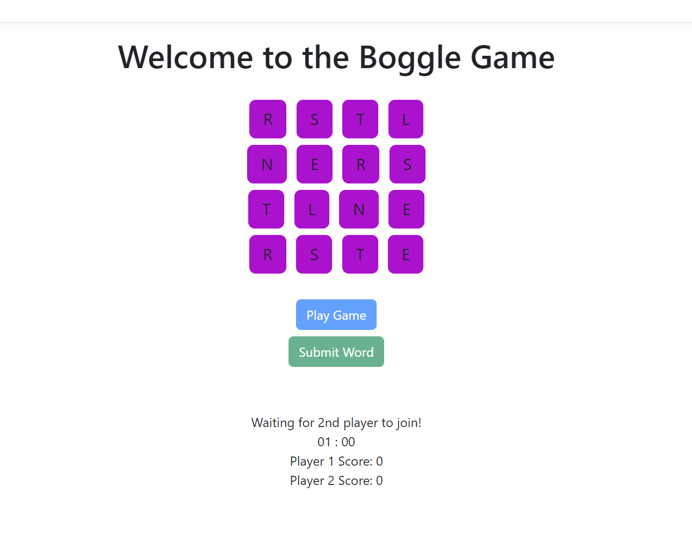
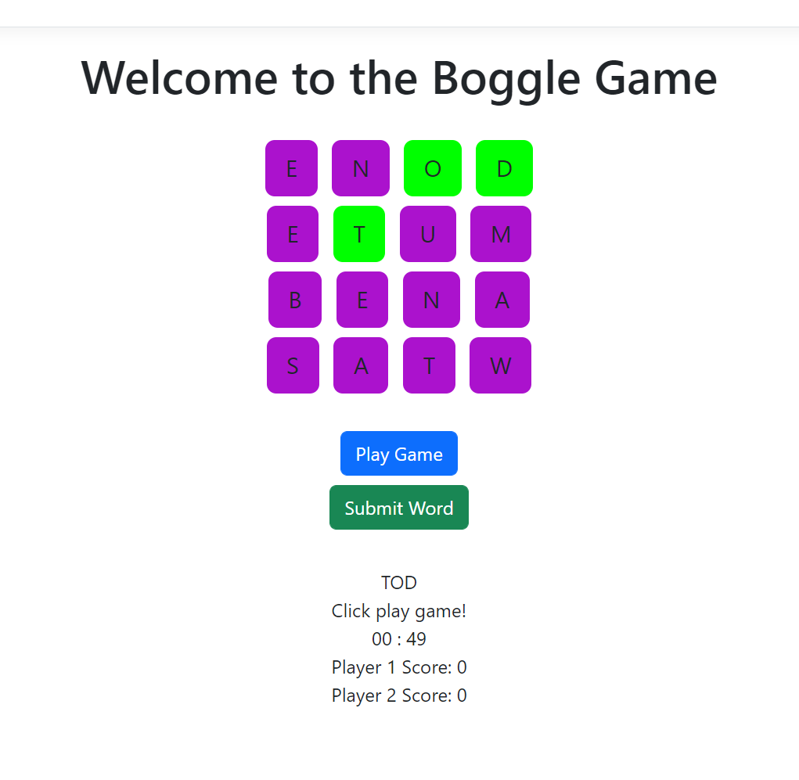
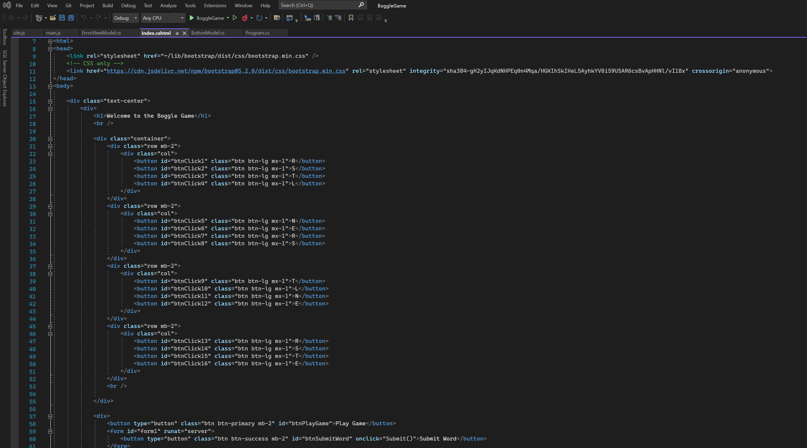
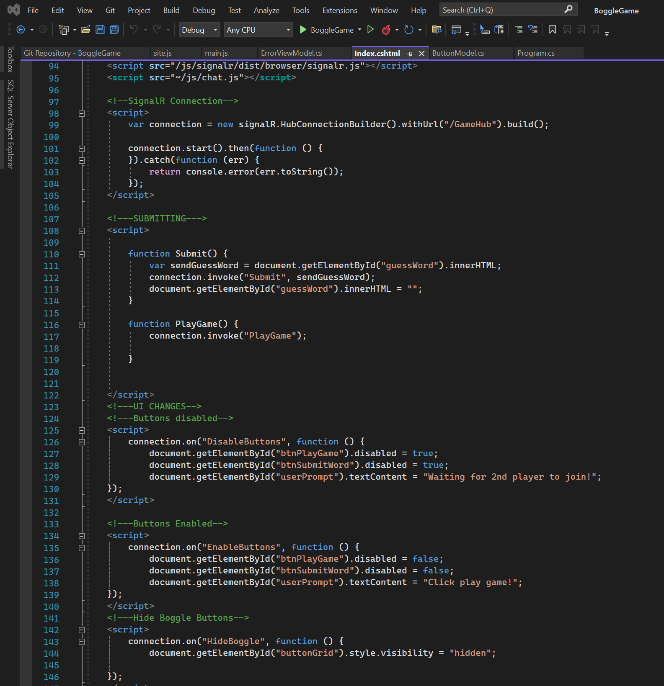

<html>
    <head>
        <link rel="stylesheet" href="https://cdn.jsdelivr.net/npm/bootstrap@4.3.1/dist/css/bootstrap.min.css" integrity="sha384-ggOyR0iXCbMQv3Xipma34MD+dH/1fQ784/j6cY/iJTQUOhcWr7x9JvoRxT2MZw1T" crossorigin="anonymous">
        
<a class="btn btn-secondary" href="https://gkarma5523.github.io/Portfolio/" role="button"><--Back</a>

        <h2>Boggle Game</h2>
    </head>
    <body>
        
The Boggle Game was a change in flow as not only was this created with a different team but we did not utilize Entity Framwork and just used MYSQL database for connection. The development of the game was somewhat slow initially as we were not sure how to take it. Creation of the grid and implementing letters for the user to pick was one thing but linking the buttons together and getting them to not duplicate, space, or not click at all was a task in and of its own. The game is setup like your normal Boggle with a twist. It is two player. The game will require two people to be on the game before you can play. Once that has been done, any player can start the game at what point you have a minute and a half to get as many words as possible without utilizing words guessed by the other player. At the end of the time, your score will be added up to determine the winner. The utilization of SignalR helped with the multiplayer aspect as well as the loading of words each player gets without reloading the page. I also brought Bootstrap to the party as many of my team was not aware of what it was. The simple ability to design your UI with little effort saved lots of time.

        

            

                

                    
                    
The main game page

                

                

                    
                    
Game play of Boggle

                

            

        

        
The board game with 16 random letters will let you select them in sequence as long as they are connected together. The players scores are stored at the bottom and the ability to click a word and submit it keeps the game fast paced. Each new game the board will reset just by clicking on Play Game. You can play this as many times as you want as long as you have two people.

        
        <h4>Struggles:</h4>
        
My biggest struggle on this program was the implementation of SingalR. That was a task that I was asked to work on and it took two of us. Implementing the JavaScript and the basic HTML was not too bad. The communication between two users while live updating the page was a new task. The implementation of Web Sockets came with that SignalR and needing to learn it while the game was developing was difficult. On top of that the group was new to GIT and so would work or develop on branches that they were not sure about. We would merge a branch and someone would continue to work on it causing merge conflicts as well as loss of work. There were some learning curves but overall you can see the finished product.

        

            

                

                    
                    
Some of the functionality

                

                

                    
                    
The HTML code designing the page

                

            

        

    </body>
</html>
